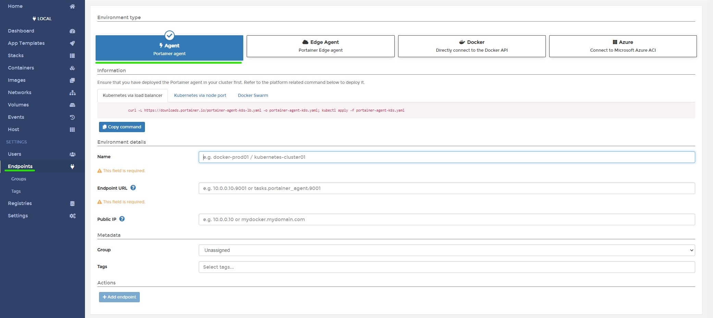

# Manage multiple Docker instances using Portainer agent

## Run instance of portainer agent on docker instance

```sh
docker run -d -p 9001:9001 --name portainer_agent --restart=always -v /var/run/docker.sock:/var/run/docker.sock -v /var/lib/docker/volumes:/var/lib/docker/volumes portainer/agent
```
## Configure endpoint in Portainer on management instance

